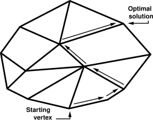
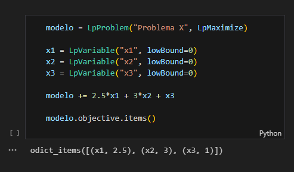
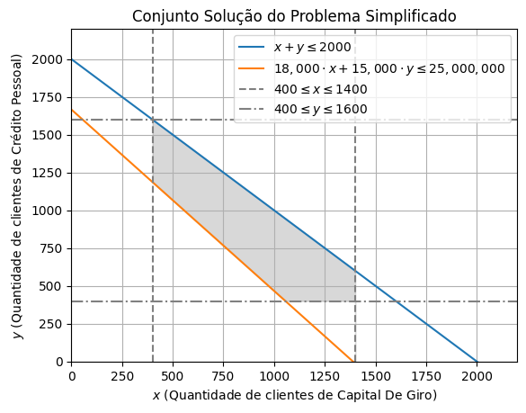

# Application of the Simplex Method in Optimizing a Gradual Implementation in Credit Modalities

## Table of Contents

- [0. Abstract](#abstract)

- [1. Introduction](#1-introduction)
    - [1.1. What is the Simplex method?](#11-what-is-the-simplex-method)
    - [1.2. Why did I choose to use the Simplex Method?](#12-why-did-i-choose-to-use-the-simplex-method)

- [2. Problem](#2-problem)
    - [2.1. Optimizing AutoProvision's Initial Credit Portfolio](#21-optimizing-autoprovisions-initial-credit-portfolio)

- [3. Model](#3-model)
    - [3.1. Variables](#31-variables)
    - [3.2. Objective Function](#32-objective-function)
    - [3.3. Constraints](#33-constraints)

- [4. Practical Application](#4-practical-application)
    - [4.1. How does PuLP work?](#41-how-does-pulp-work)
    - [4.2. Setting up a Jupyter environment](#42-setting-up-a-jupyter-environment)
    - [4.3. Solving the problem with PuLP](#43-solving-the-problem-with-pulp)
    - [4.4. Analysis with sliders](#44-analysis-with-sliders)
    - [4.5. Graphical representation](#45-graphical-representation)

- [5. Results](#5-results)

- [6. Conclusion](#6-conclusion)

- [7. References](#7-references)

## Abstract

The article addresses the fictional case of the company AutoProvision. The main goal is to determine the best combination of clients across different credit modalities (Working Capital, Overdraft, Personal Loan, etc.) to maximize expected profit during an initial phase of gradual project implementation.
For this, we use Linear Programming, modeling the problem with decision variables (number of clients per modality), an objective function (maximize total profit), and constraints (capital limits, total client capacity, demand per modality, and a minimum for diversification).
The model was implemented in Python using the PuLP library and solved using the Simplex Method. The results define the optimal allocation of clients for each credit line in this first cycle, resulting in a data-driven action plan for the start of AutoProvision's operations, as well as serving as a basis for future analyses and adjustments as the business evolves.
The work demonstrates the practical application of optimization tools in a business context, including visualization and analysis of the results.

### Keywords

Simplex Method. Optimization. Linear Programming. Operations Research. Credit Modalities. Credit Portfolio. Risk Management. Gradual Implementation. PuLP (Python Library). Python (Programming Language). Data-Driven Decision Making. Mathematical Model. Sensitivity Analysis. Finance. Jupyter Notebook. Working Capital. Overdraft. Personal Loan. Payroll Loan. Mortgage Loan.

## 1. Introduction

### 1.1. What is the Simplex method?

In the daily routine of many technical areas, such as logistics, production, finance, or engineering, we often need to make decisions to use our resources in the best possible way. Think about defining the best delivery routes to save fuel, organizing production in a factory to maximize the number of products, or choosing investments to get the highest return. Basically, we are talking about optimization: finding the best solution (whether the maximum of something good or the minimum of something bad) within certain rules or limitations we have.

Many of these problems fit into a category called Linear Programming (LP). The idea is relatively simple: these are problems where both the objective you want to achieve (e.g., maximize profit) and the limitations you face (e.g., available budget, working hours) can be described using linear equations or inequalities – they are direct relationships, without powers or multiplications between variables. Although they seem simple, LP is a powerful tool for representing and solving many practical situations.


And how do we solve these Linear Programming problems? One of the most well-known and fundamental tools for this is the Simplex Method. Created by George Dantzig in the 1940s, the Simplex is essentially an algorithm, a step-by-step recipe. Imagine that all possible solutions that respect your limitations form a kind of geometric "region" with well-defined corners. The Simplex Method works iteratively: it starts at one of these corners (a valid initial solution) and "jumps" to neighboring corners, always looking for one that improves the result of your objective (more profit, less cost, etc.). It continues doing this until it finds a corner where there is no further improvement possible – this is the optimal point, the best answer to your problem.



To use the Simplex algorithm in a programming context, you need software that implements this algorithm. There are several options available, from commercial tools to open-source libraries. One of the most popular and accessible is PuLP, the Python library we will be using in a Jupyter Notebook environment.

PuLP is a free and open-source Python library created specifically for modeling linear programming problems (and also integer programming, a variation). It was initially developed by the COIN-OR Foundation and other contributors, with work beginning in the mid-2000s, and is now part of the COIN-OR (Computational Infrastructure for Operations Research) ecosystem, an initiative that brings together various operations research tools. The main idea behind PuLP is not to reimplement the Simplex algorithm from scratch, but rather to provide a user-friendly interface in Python so you can describe your optimization problem.

PuLP allows you to translate the mathematical elements of linear programming directly into Python code:
- Define the Problem: You create an object representing your problem, indicating whether you want to maximize or minimize something (e.g., `LpProblem("ProblemName", LpMaximize)`).
- Create Variables: You declare the decision variables (those for which the Simplex will find the optimal value), such as the quantity of each product to manufacture (using `LpVariable("VariableName", lowBound=0)` to indicate it cannot be negative, for example).
- Add the Objective Function: You write the mathematical expression you want to optimize (like `2*x + 3*y`) and add it to your problem object.
- Add Constraints: Similarly, you write your limitations (like `x + y <= 100`) and add them to the problem.


After modeling the problem this way, PuLP performs the "magic": it communicates with external solvers – programs that effectively contain efficient implementations of the Simplex (or other optimization algorithms). Some common solvers that PuLP can use are CBC (which usually comes bundled or is easy to install), GLPK, Gurobi, or CPLEX. PuLP formats your problem, sends it to the chosen solver, and then brings the answer back to your Python code, reporting the optimal values for your variables and the result of the objective function.

In summary, PuLP acts as an intelligent bridge: it allows you to use the familiar Python syntax to build your optimization model, while leveraging the power of complex algorithms like Simplex implemented in dedicated solvers, without you needing to worry about the internal details of these algorithms.

### 1.2. Why did I choose to use the Simplex Method?

The choice came from a combination of learning and practical necessity. This decision was made during Operations Research classes in college. We were learning about this specific optimization technique, and the Simplex method was presented as a powerful tool for solving linear programming problems. The professor then challenged us to apply this method to our ongoing research and innovation projects.

My project is related to the field of loans and credit. When the need arose to plan a gradual implementation of the project, we realized we would need significant capital and, for that, we would have to decide which credit modalities would be most advantageous to raise or manage funds. We had several options available, such as working capital, personal loans, mortgage loans, among others, each with its distinct characteristics of interest rates, volume of prior proposals (made through the initial lead capture form), and average capital involved.

It was in this scenario that the Simplex Method fit perfectly. It offered the ideal structure to model this complex decision: we could define a clear objective (maximize the expected profit or return from these credit operations) and, at the same time, consider various constraints (such as capital limits, service capacity, or specific targets). Basically, the Simplex would allow us to find the optimal "recipe," indicating how much to invest or focus on each credit modality to obtain the best possible financial result within the established rules. Although the Simplex method is often associated with logistics or production problems, its application in a context of financial optimization for businesses seemed not only appropriate but also very relevant to the challenge at hand. Therefore, we decided to use it as the central tool to analyze the problem we will describe next.

## 2. Problem

### 2.1. Optimizing AutoProvision's Initial Credit Portfolio

To understand the challenge we will analyze with the Simplex Method, let's first get to know the scenario and the fictional company created for this research and innovation project: AutoProvision. Imagine AutoProvision as a facilitator, a bridge between customers seeking credit and financial institutions willing to lend. Its goal is to make this process simpler and more efficient for everyone.

In our project, we simulated that AutoProvision conducted an in-depth market study. For this, it combined historical data from the credit sector (inspired by information that could come from real sources like the Central Bank of Brazil, covering the period since 2012) with the results of its own form, applied to gauge the interest of potential customers in different types of loans.

After collecting and organizing this information, AutoProvision arrived at a summary of the main credit modalities it could offer, along with some metrics for each:

| Modality        | Proposals Received | Capital Required (Avg per client) | Interest Rate (%) |
| --------------- | ------------------ | --------------------------------- | ----------------- |
| Working Capital | 1400               | 18000                             | 2.13              |
| Overdraft       | 600                | 10000                             | 8.16              |
| Personal Loan   | 1600               | 15000                             | 6.43              |
| Payroll Loan    | 6000               | 12500                             | 2.36              |
| Mortgage Loan   | 3400               | 13425                             | 0.81              |
| Auto Loan       | 3400               | 8500                              | 1.86              |

With this table in hand, the central problem arises: if AutoProvision decided to accept all the proposals received from its potential clients, the total amount of capital needed to finance these operations would be extremely high. For a company (especially in an initial or testing phase), taking on such a large volume of operations all at once would be a considerable financial risk.

Given this, the most sensible strategy would be to start with a gradual implementation. That is, begin operating with a smaller volume, test the viability of the business model, adjust processes, and only then seek more investment to expand the client portfolio. For this initial phase, AutoProvision would need to define clear limits: a maximum number of clients it could serve and a ceiling for the total capital it could allocate.

And this is exactly where optimization becomes crucial. Given these limitations, how should AutoProvision choose which and how many clients to accept from each modality? Simply choosing randomly or focusing only on the modality with the highest interest rate might not be ideal, as other factors are at play (such as the capital required per client). It was this need – to find the optimal combination of loans to maximize expected profit, given the business rules and the constraints of capacity and capital – that led us directly to the application of the Simplex Method. We needed an algorithm to help us make the best possible decision within this specific scenario.

## 3. Model

### 3.1. Variables

The heart of the problem is deciding how many clients we will accept for each of the six available credit modalities. These quantities are precisely the decision variables that the Simplex Method will optimize. These quantities are:

- $x1$: Number of clients accepted for Working Capital
- $x2$: Number of clients accepted for Overdraft
- $x3$: Number of clients accepted for Personal Loan
- $x4$: Number of clients accepted for Payroll Loan
- $x5$: Number of clients accepted for Mortgage Loan
- $x6$: Number of clients accepted for Auto Loan

It is important to note that these values cannot be negative, so they must all be greater than or equal to zero ($xi ≥ 0$). The goal of the Simplex will be to find the ideal values for $x1$, $x2$, ..., $x6$.

### 3.2. Objective Function

The main objective is clear: maximize the total expected profit. To construct the formula that represents this, we calculate the estimated profit generated by a single client in each modality. An estimate made by multiplying the monthly interest rate by the average capital needed for that type of loan.

`Individual Client Profit = Interest Rates (%) * Average Capital Required * Number of Clients`

- Working Capital = 2.13% × R$18,000 × $x1$
- Overdraft = 8.16% × R$10,000 × $x2$
- Personal Loan = 6.43% × R$15,000 × $x3$
- Payroll Loan = 2.36% × R$12,500 × $x4$
- Mortgage Loan = 0.81% × R$13,425 × $x5$
- Auto Loan = 1.86% × R$8,500 × $x6$

The total profit, which we want to maximize, will be the sum of the profit obtained from all accepted clients in each modality. Mathematically, our objective function is:

`Maximize Profit = Profit x1 + Profit x2 + Profit x3 + Profit x4 + Profit x5 + Profit x6`

### 3.3. Constraints

Now, we need to define the limitations and rules that AutoProvision must follow in this initial phase. These are the constraints of our model:

- **Total Client Limit:** The operational capacity for this phase is a maximum of 6,000 clients. Therefore, the sum of all accepted clients in the different modalities cannot exceed this value.

    `x1 + x2 + x3 + x4 + x5 + x6 ≤ 6000`

- **Demand Limit per Modality:** We cannot accept more clients for a modality than the number of proposals we received (according to Table 1). This generates a constraint for each type of loan:

    `x1 ≤ 1400 (Maximum for Working Capital)`

    `x2 ≤ 600 (Maximum for Overdraft)`

    `x3 ≤ 1600 (Maximum for Personal Loan)`

    `x4 ≤ 6000 (Maximum for Payroll Loan)`

    `x5 ≤ 3400 (Maximum for Mortgage Loan)`

    `x6 ≤ 3400 (Maximum for Auto Loan)`

- **Total Capital Limit:** The total budget available to allocate to loans in this phase is R$ 125,000,000.00.

    `18000 × x1 + 10000 × x2 + 15000 × x3 + 12500 × x4 + 13425 × x5 + 8500 × x6 ≤ 125,000,000`

- **Minimum Clients per Modality (Diversification/Testing):** To ensure we have a good exploration rate and gain experience in all offered credit lines, a business rule was defined requiring the acceptance of a minimum number of clients in each category. Analyzing the implementation, it seems this minimum was set at 400 clients per modality. This ensures a minimum sample for viability analysis of each product.

    `x1 ≥ 400`

    `x2 ≥ 400`

    `x3 ≥ 400`

    `x4 ≥ 400`

    `x5 ≥ 400`

    `x6 ≥ 400`

With these variables, the objective function, and all constraints properly defined, we have a complete Linear Programming model. Now, we can use a solver (like PuLP, used in the code) that implements the Simplex Method (or a similar algorithm) to find the values of $x1$ to $x6$ that maximize the total profit while respecting all these imposed rules.

## 4. Practical Application

### 4.1. How does PuLP work?

When we use PuLP, we are writing Python code, but the library needs to transform this into a mathematical representation that a solver (the program that actually does the optimization calculations, like CBC) can understand. The magic happens through how PuLP handles the operations we perform with its variables.

#### Building the Objective Function

When you write something like:
```python
model += 383.40 * x1
model += 816.00 * x2
```

We use `+=` without any comparison sign (like `<=`, `>=`, `==`). This is how PuLP knows we are adding a term to the model's objective function. You can add as many terms as you like; PuLP will sum them all up to form the final expression we want to maximize (or minimize).

But what really happens when we write `383.40 * x1`? PuLP "redefines" common Python mathematical operators (like *, +, -, /, using operator overloaders) when applied to its special variables (LpVariable, like our x1). Instead of simply calculating 383.40 times the current value of x1 (which we don't even know yet), PuLP creates an internal object, a kind of "mini-formula" called `pulp.LpAffineExpression`. This object represents the mathematical idea of "383.40 × the final value of x1".

PuLP builds the complete mathematical structure of your problem; it doesn't solve anything immediately. It assembles the entire recipe (variables, objective, constraints) to later hand everything over to the solver, which is the one that will find the optimal values.

If you perform multiple operations on the same variable sequentially, it simplifies what is possible. See the table you prepared, which illustrates this well:

| Code                 | PuLP Interpretation  | Explanation                                                                   |
| -------------------- | -------------------- | ----------------------------------------------------------------------------- |
| `1.5*x1`             | `'1.5*x1'`           | Conventional example                                                          |
| `1.5*x1 + 1.5`       | `'1.5*x1 + 1.5'`     | Different operations (multiplication and addition), nothing pre-calculated    |
| `1.5*x1 + 1.5*x2`    | `'1.5*x1 + 1.5*x2'`  | Same operation, but on different variables (x1, x2), nothing pre-calculated   |
| `10*1.5*x1 + 1.5*x2` | `'15.0*x1 + 1.5*x2'` | Consecutive multiplications on the same variable (x1), PuLP calculates 10*1.5 |
| `1.5*x1*10 + 1.5*x2` | `'15.0*x1 + 1.5*x2'` | Even with *10 afterwards, PuLP simplifies the part related to x1              |

If necessary, PuLP provides a visualization method for each variable of the objective function:



#### Defining Constraints

And how does PuLP know that something is a constraint and not part of the objective? By the presence of comparison operators. When you write:

```python
model += 18000*x1 + 10000*x2 + ... <= 125000000
```

The use of `<=` (or `>=`, `==`) is the signal for PuLP. The library uses the "magic" of operator redefinition (in this case, comparison operators like `__le__` for `<=`, `__ge__` for `>=`, etc.). Instead of checking if the condition is true or false now, PuLP creates an object representing the entire constraint: the left-hand side expression, the comparison type, and the right-hand side value.

This complete constraint is added to the model's list of rules. The solver, when called by the `model.solve()` command, will receive all these constraints and must find a solution that respects all of them while optimizing the objective function.

The model's constraints can be viewed at any time with the attributes `model.constraints` or `model.coefficients` (coefficients are the weights assigned to each variable used in the constraint); As in the example:


### 4.2. Setting up a Jupyter environment

To run the code, you will need a Jupyter Notebook environment. You can use Google Colab or install Jupyter locally. For this project, a development container with Visual Studio Code was configured to facilitate setting up the notebook locally. This container automatically installs the Python version used in building the model, all extensions, plus the `ipykernel`, `jupyter`, and `pulp` libraries, which are necessary to run the code. To use the development container, you will need [Docker](https://www.docker.com/get-started/) installed on your machine.

When you open the project in VSCode, you will see a notification asking if you want to open the project in a container. Click "Reopen in Container". This will create an isolated environment with all the necessary dependencies to run the code, separate from your local environment and avoiding version conflicts.

After opening the container, you will see a directory called `notebook` in the side panel. Inside it, you will find several notebooks containing the model's code. For now, we will only deal with `solver.ipynb`, which contains the explained code of the model.

### 4.3. Solving the problem with PuLP

The problem, with all its rules and objectives, was translated into Python code using the PuLP library.

The complete code is available in the project's [repository](https://github.com/joaqu1m/credit-types-simplex-method), but let's look at the main steps executed in the `solver.ipynb` notebook to arrive at the answer.

#### Preparing the Ground

First of all, we need to ensure the PuLP library is available in the environment and import its functions:

```python
# Ensures PuLP is installed
%pip install pulp

# Imports everything from the library for ease of use
from pulp import *
```

#### Building the Model in Code

With the environment ready, we start building the model:

1. **Creating the problem "skeleton":** We indicate that we want to create a problem named 'Maximize_Profit_Credit_Modalities' and that the objective is maximization (LpMaximize).

2. **Declaring decision variables:** We define our variables x1 to x6, which will represent the number of clients for each modality. We use `lowBound=0` to ensure these numbers are non-negative.

    ```python
    # Creates the problem object
    model = LpProblem('Maximize_Profit_Credit_Modalities', LpMaximize)

    # Creates the decision variables
    x1 = LpVariable('Num_Clients_Working_Capital', lowBound=0)
    x2 = LpVariable('Num_Clients_Overdraft', lowBound=0)
    x3 = LpVariable('Num_Clients_Personal_Loan', lowBound=0)
    x4 = LpVariable('Num_Clients_Payroll_Loan', lowBound=0)
    x5 = LpVariable('Num_Clients_Mortgage_Loan', lowBound=0)
    x6 = LpVariable('Num_Clients_Auto_Loan', lowBound=0)
    ```

3. **Adding the Objective Function:** We write the mathematical expression for the total profit (calculated as seen in the Model section) and add it to the model.

    ```python
    # Defines the function to be maximized (Total Profit)
    model += \
        (2.13 / 100 * 18_000 * x1) + \
        (8.16 / 100 * 10_000 * x2) + \
        (6.43 / 100 * 15_000 * x3) + \
        (2.36 / 100 * 12_500 * x4) + \
        (0.81 / 100 * 13_425 * x5) + \
        (1.86 / 100 * 8_500 * x6), 'Total_Profit'
    ```

4. **Adding Constraints:** We implement each of the business rules as constraints in the model.
    - **Maximum total client limit:**

        ```python
        MAX_CLIENTS = 6000
        model += x1 + x2 + x3 + x4 + x5 + x6 <= MAX_CLIENTS, 'Total_Processed_Clients'
        ```

    - **Maximum client limit per modality (based on demand):**

        ```python
        # We use a loop to add the maximum constraints per modality
        for var in [
            (x1 <= 1400, 'Max clients for Working Capital'),
            (x2 <= 600, 'Max clients for Overdraft'),
            (x3 <= 1600, 'Max clients for Personal Loan'),
            (x4 <= 6000, 'Max clients for Payroll Loan'),
            (x5 <= 3400, 'Max clients for Mortgage Loan'),
            (x6 <= 3400, 'Max clients for Auto Loan'),
        ]:
            model += var
        ```

    - **Maximum total capital limit:**

        ```python
        MAX_CAPITAL = 125_000_000
        model += \
            18_000 * x1 + \
            10_000 * x2 + \
            15_000 * x3 + \
            12_500 * x4 + \
            13_425 * x5 + \
            8_500 * x6 <= MAX_CAPITAL, 'Total_Available_Capital'
        ```

    - Minimum clients per modality (for diversification):

        ```python
        MIN_SAMPLE_POSSIBLE = 400
        # We use another loop to add the minimum constraints per modality
        for var in [
            (x1 >= MIN_SAMPLE_POSSIBLE, 'Min clients for Working Capital'),
            (x2 >= MIN_SAMPLE_POSSIBLE, 'Min clients for Overdraft'),
            (x3 >= MIN_SAMPLE_POSSIBLE, 'Min clients for Personal Loan'),
            (x4 >= MIN_SAMPLE_POSSIBLE, 'Min clients for Payroll Loan'),
            (x5 >= MIN_SAMPLE_POSSIBLE, 'Min clients for Mortgage Loan'),
            (x6 >= MIN_SAMPLE_POSSIBLE, 'Min clients for Auto Loan'),
        ]:
            model += var
        ```

#### Finding the Solution and Viewing Results

With the model completely defined in the code, the final step is to ask PuLP to solve it and then view the results found:

1. **Solving the model:** A simple command triggers the optimization process. `msg=False` is just to avoid detailed solver messages in the output.

    ```python
    # Asks PuLP/CBC to find the optimal solution
    model.solve(PULP_CBC_CMD(msg=False))
    # The output '1' indicates that an optimal solution was found
    ```

2. **Visualizing results:** We check the optimal values the solver found for each of our variables (x1 to x6) and the maximum value of the objective function (total profit).

    ```python
    # Prints the optimal values found for each variable
    print(f"Working Capital Clients (x1): {x1.varValue}")
    print(f"Overdraft Clients (x2): {x2.varValue}")
    print(f"Personal Loan Clients (x3): {x3.varValue}")
    print(f"Payroll Loan Clients (x4): {x4.varValue}")
    print(f"Mortgage Loan Clients (x5): {x5.varValue}")
    print(f"Auto Loan Clients (x6): {x6.varValue}")

    # Prints the maximum value of the objective function (Total Profit)
    print(f"Total Profit: {model.objective.value()}")
    ```

**Results Output:**

```
Working Capital Clients (x1): 1400.0
Overdraft Clients (x2): 600.0
Personal Loan Clients (x3): 1600.0
Payroll Loan Clients (x4): 1600.0
Mortgage Loan Clients (x5): 400.0
Auto Loan Clients (x6): 400.0
Total Profit: 3148297.0
```

And so, by following these steps in the code, we were able to use PuLP to find the ideal combination of clients per modality that maximizes AutoProvision's profit, respecting all the limitations defined for this initial phase of the project.

### 4.4. Analysis with sliders

To go beyond the static solution presented by the conventional solver and allow for more dynamic exploration of the model, an interactive interface was implemented directly in the Jupyter Notebook environment. Using the `ipywidgets` library, the solver code was adapted to incorporate sliders and can be found in the `sliders-solver.ipynb` file.

These sliders were linked to key parameters of the model (e.g., capital limits, minimum or maximum number of clients per modality, etc.). By manipulating a slider, the user changes the value of the corresponding variable in real time. This change automatically triggers a new execution of the PuLP solver with the updated parameters. The optimization result, especially the recalculated value of the objective function (Total Profit), is displayed immediately in the notebook interface.

This approach aims to transform the analysis into a more intuitive process, allowing instant visualization of how changes in constraints or objectives impact the optimal solution. An example of this functionality can be seen in the animation below, which shows the alteration of a parameter via slider and the consequent update of the result:


This tool can become quite useful for understanding and identifying which parameters have the greatest influence on the final result.

### 4.5. Graphical representation

Although the complete optimization problem involves six decision variables (x1 to x6) and thus cannot be visualized in a simple two-dimensional graph, it is interesting to analyze a graphical representation of a simplified version of the problem. This helps understand how constraints define the space for feasible solutions.

The following code, extracted from the `graphic-solver.ipynb` notebook, uses the `matplotlib` and `numpy` libraries to generate a two-dimensional graph showing the model's constraints, focusing on only two hypothetical variables: x (representing, for example, Working Capital) and y (representing Personal Loan).

#### Initial Setup and Libraries:

First, we ensure matplotlib is installed and import the necessary libraries. We also configure the size of the graph figure.

```python
# Ensures matplotlib is installed
%pip install matplotlib

# Imports libraries
import numpy as np
import matplotlib.pyplot as plt

# Defines the x-axis range and configures the figure
x = np.linspace(0, 2200, 200)
plt.figure(figsize=(10, 6))
```

#### Plotting Linear Constraints:

The main constraints are plotted as lines on the graph. For this, we define the inequalities to define the boundaries on the graph.

- **Constraint 1:** $x+y \leq 2000$

    ```python
    y1 = 2000 - x
    plt.plot(x, y1, label=r'$x + y \leq 2000$');
    ```

- **Constraint 2:** $18,000 \cdot x + 15,000 \cdot y \leq 25,000,000$

    ```python
    y2 = (25000000 - 18000*x) / 15000
    plt.plot(x, y2, label=r'$18,000 \cdot x + 15,000 \cdot y \leq 25,000,000$');
    ```

#### Plotting Limit Constraints (Box Constraints):

The constraints defining lower and upper limits for variables x and y ($400 \leq x \leq 1400$ and $400 \leq y \leq 1600$) are represented as dashed vertical and horizontal lines.

```python
# Vertical lines for x limits
plt.axvline(400, color='gray', linestyle='--', label=r'$400 \leq x \leq 1400$')
plt.axvline(1400, color='gray', linestyle='--')

# Horizontal lines for y limits
plt.axhline(400, color='gray', linestyle='-.', label=r'$400 \leq y \leq 1600$')
plt.axhline(1600, color='gray', linestyle='-.');
```

#### Identifying and Filling the Feasible Region:

The feasible region is the area of the graph where all constraints are satisfied, and the following code uses the `plt.fill_between` function to shade this area. For this to work as expected, we run some auxiliary functions that use the minimum and maximum values of the constraints and inequalities.

```python
def min_max(var, min_val, max_val):
    return np.minimum(max_val, np.maximum(min_val, var))

x_sides = min_max(x, 400, 1400)
y_lower = min_max(y2, 400, y1)
y_upper = min_max(y1, y2, 1600)

plt.fill_between(x_sides, y_lower, y_upper, where=(y_upper >= y_lower), color='gray', alpha=0.3);
```

#### Finalizing the Graph:

We add labels, title, and legends to make the graph more informative.

```python
plt.xlim(0, 2200)
plt.ylim(0, 2200)

plt.xlabel(r'$x$ (Number of Working Capital clients)')
plt.ylabel(r'$y$ (Number of Personal Loan clients)')

plt.legend()

plt.title('Solution Set of the Simplified Problem')
plt.grid(True)
plt.show()
```

The final result is a graph illustrating the problem's constraints and the feasible region, where all conditions are met. This visualization helps understand how different constraints define the solution set space.



## 5. Results

After executing the Linear Programming model, we arrived at the optimal combination of clients per credit modality that maximizes AutoProvision's expected profit, given the constraints defined for this initial phase of gradual implementation.

The results obtained were as follows:

- **Working Capital Clients:** 1400 clients
- **Overdraft Clients:** 600 clients
- **Personal Loan Clients:** 1600 clients
- **Payroll Loan Clients:** 1600 clients
- **Mortgage Loan Clients:** 400 clients
- **Auto Loan Clients:** 400 clients

With this client distribution, the maximum estimated Total Profit for the first month of the first cycle is **R$ 3,148,297.00** (a very high value, considering the extremely high parameter values).

### Analysis of Results and Business Implications

These numbers offer us some insights into how we should direct our efforts and resources at the start of operations:

1. **Modalities at the Demand Limit:** Working Capital, Overdraft, and Personal Loan modalities reached exactly the maximum number of received proposals that we defined as the upper limit. This suggests that, within the current constraints (especially capital and total capacity), these are the most attractive modalities from the perspective of profit generated per client or the combination of profit and capital usage.

2. **Modalities at the Minimum Limit:** On the other hand, Mortgage Loan and Auto Loan remained at the minimum floor of 400 clients established as a business rule to maintain diversification and learning across all lines. This indicates that if the focus of this cycle were profit maximization, these modalities would be less prioritized. The minimum constraint was certainly the reason for ensuring they were included in the initial portfolio.

3. **Payroll Loan:** This modality had a distinct result, indicating that the model, considering all parameters, opted for a relatively simple strategy:
    - Accept the maximum possible clients for the most profitable modalities;
    - Accept the minimum possible clients for the least profitable modalities;
    - Accept the maximum possible clients for the fourth most profitable modality (Payroll Loan), respecting all existing constraints, such as demand, total number of clients, total capital, and the specific constraints of the modality itself.

### Next Steps in Gradual Implementation

With these results in hand, AutoProvision has a more optimized plan for the first cycle of its gradual implementation. The strategy will be to focus on acquiring and servicing the exact quantities of clients indicated by the model for each modality.

This first cycle will serve not only to generate the predicted profit but also as a practical validation of the model and the business. It will be extremely important to collect real data on costs, delinquency, and client behavior in each modality. This information will be fundamental for refining the model (adjusting expected profit rates, for example) and reassessing the constraints (such as the capital limit or service capacity) for the next cycles of business expansion.

## 6. Conclusion

This article demonstrated how a classic Operations Research tool, the Simplex Method, can be practically applied to solve a common business challenge: how to start a new operation gradually and optimally.

The central problem we solved was that of the fictional company AutoProvision, which needed to decide the best combination of clients from different credit modalities to serve in its initial phase, aiming to maximize profit while considering important limitations of total capital, service capacity, specific product demand, and the need to diversify its operations.

Linear Programming provided a good mathematical structure to model this scenario. We defined the decision variables (number of clients per modality), the objective function (maximize total profit calculated from rates and average capital), and the constraints (limits on capital, clients, demand, and diversification).

Using the PuLP library in Python, we translated this mathematical model into executable code. The Simplex algorithm was applied to find the optimal solution. The results precisely indicated how many clients of each modality AutoProvision should seek in this first cycle to achieve the maximum possible profit within the established rules, utilizing all the defined operational capacity.

The main contribution of this work is to show that optimization does not need to be an abstract concept or restricted to large industries. Accessible tools like PuLP allow even simpler business scenarios, such as the phased implementation of a service, to benefit from a data-driven approach to make more efficient and potentially more profitable decisions. In addition to the main solution, we explored how interactive tools (sliders) and graphical visualizations can enrich the analysis and understanding of the model.

Finally, it is important to remember that this model represents the starting point. The true value will materialize over time as AutoProvision collects real data from its operations. This data will allow refining profit estimates, adjusting constraints, and perhaps even adapting the objective. The application of the Simplex method provided a robust and optimized initial plan, but continuous improvement will be key to long-term success.

## 7. References

- [SIMPLEX ALGORITHM - Wikipedia](https://en.wikipedia.org/wiki/Simplex_algorithm).
- [COIN-OR FOUNDATION WEBSITE - Computational Infrastructure for Operations Research](https://www.coin-or.org/).
- [OPTIMIZATION WITH PULP - PuLP Documentation](https://coin-or.github.io/pulp/).
- [SCR CREDIT OPERATIONS DATABASE - Central Bank of Brazil](https://dadosabertos.bcb.gov.br/dataset/scr_data).
- [INTEREST RATE DATABASE - Central Bank of Brazil](https://www.bcb.gov.br/estatisticas/txjuros).
- [PYPLOT - Matplotlib Documentation](https://matplotlib.org/stable/api/pyplot_summary.html).
