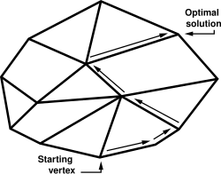
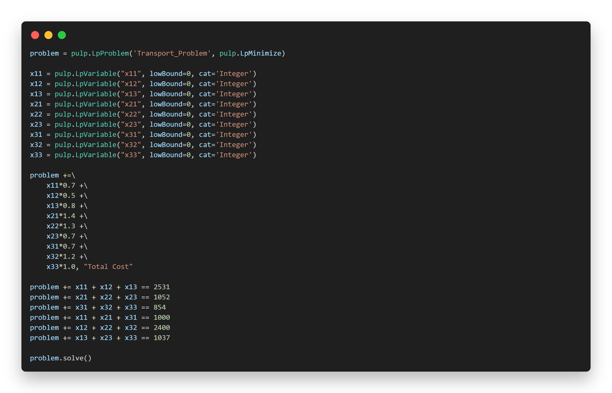
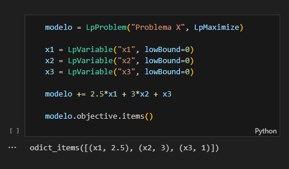
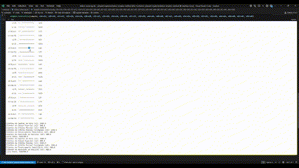
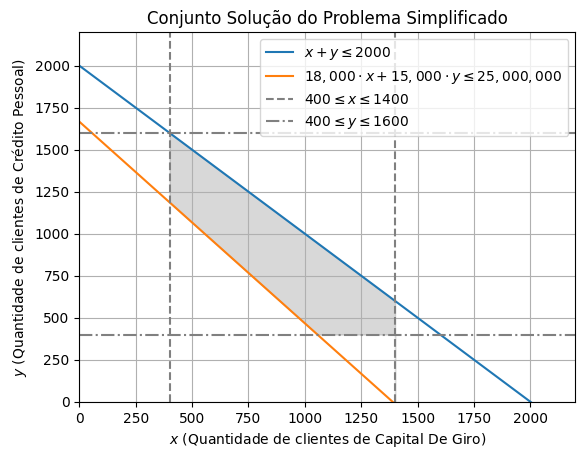

# Aplicação do método Simplex na otimização de uma implementação gradual em modalidades de crédito

## Sumário

- [Resumo](#resumo)

- [Introdução](#1-introdução)

- [Problema](#2-problema)

- [Modelo](#3-modelo)

- [Aplicação Prática](#4-aplicação-prática)

- [Resultados](#5-resultados)

- [Conclusão](#6-conclusão)

- [Referências](#7-referências)

## Resumo - Retomarei depois

O artigo apresenta um modelo de programação linear (LP) que visa maximizar o lucro total de uma empresa, considerando a implementação gradual de um novo produto. O modelo é baseado em um problema de alocação de recursos, onde o objetivo é determinar a quantidade de cada tipo de cliente a ser atendido a cada 4 meses, levando em conta as restrições de capacidade e demanda.
O modelo é resolvido utilizando o método Simplex, uma técnica amplamente utilizada em programação linear. O artigo também discute a aplicação prática do modelo, incluindo a análise de resultados e a interpretação dos dados obtidos.
O objetivo desse problema é determinar a quantidade de cada tipo de cliente a ser atendido a cada 4 meses, de um modo que tentamos maximizar o lucro total enquanto buscamos descobrir o potencial de todos os recursos disponíveis.

## 1. Introdução

### 1.1. O que é o método Simplex?

No dia a dia de muitas áreas técnicas, como logística, produção, finanças ou engenharia, frequentemente precisamos tomar decisões para usar nossos recursos da melhor forma possível. Pense em definir as melhores rotas de entrega para economizar combustível, organizar a produção em uma fábrica para maximizar a quantidade de produtos, ou escolher investimentos para obter o maior retorno. Basicamente, estamos falando de otimização: encontrar a melhor solução (seja o máximo de algo bom ou o mínimo de algo ruim) dentro de certas regras ou limitações que temos.

Muitos desses problemas se encaixam em uma categoria chamada Programação Linear (PL). A ideia é relativamente simples: são problemas onde tanto o objetivo que você quer alcançar (ex: maximizar lucro) quanto as limitações que você enfrenta (ex: orçamento disponível, horas de trabalho) podem ser descritos usando equações ou inequações lineares – são relações diretas, sem potências ou multiplicações entre as variáveis. Mesmo parecendo simples, a PL é uma ferramenta poderosa para representar e resolver muitas situações práticas.


E como resolvemos esses problemas de Programação Linear? Uma das ferramentas mais conhecidas e fundamentais para isso é o Método Simplex. Criado por George Dantzig nos anos 40, o Simplex é, essencialmente, um algoritmo, uma receita passo a passo. Imagine que todas as soluções possíveis que respeitam suas limitações formam uma espécie de "região" geométrica com cantos bem definidos. O Método Simplex funciona de forma iterativa: ele começa em um desses cantos (uma solução inicial válida) e vai "pulando" para cantos vizinhos, sempre buscando um que melhore o resultado do seu objetivo (mais lucro, menos custo, etc.). Ele continua fazendo isso até encontrar um canto onde não há mais para onde ir para melhorar – esse é o ponto ótimo, a melhor resposta para o seu problema.



Para utilizar o algoritmo Simplex no contexto da programação, você precisa de um software que implemente esse algoritmo. Existem várias opções disponíveis, desde ferramentas comerciais até bibliotecas de código aberto. Uma das mais populares e acessíveis é o PuLP, a biblioteca Python que estaremos utilizando em um ambiente de Jupyter Notebook.

O PuLP é uma biblioteca Python gratuita e de código aberto criada especificamente para modelar problemas de programação linear (e também programação inteira, uma variação). Ele foi desenvolvido inicialmente pela COIN-OR Foundation e outros colaboradores, com o trabalho começando em meados dos anos 2000, e hoje faz parte do ecossistema COIN-OR (Computational Infrastructure for Operations Research), uma iniciativa que reúne diversas ferramentas de pesquisa operacional. A ideia principal por trás do PuLP não é reimplementar o algoritmo Simplex do zero, mas sim fornecer uma interface amigável em Python para que você possa descrever o seu problema de otimização.

O PuLP permite que você traduza os elementos matemáticos da programação linear diretamente para o código Python:
- Definir o Problema: Você cria um objeto que representa seu problema, indicando se quer maximizar ou minimizar algo (por exemplo, LpProblem("NomeDoProblema", LpMaximize)).
- Criar as Variáveis: Você declara as variáveis de decisão (aquelas que o Simplex vai encontrar o valor ótimo), como a quantidade de cada produto a fabricar (usando LpVariable("NomeDaVariavel", lowBound=0) para indicar que não pode ser negativa, por exemplo).
- Adicionar a Função Objetivo: Você escreve a expressão matemática que quer otimizar (como 2\*x + 3\*y) e a adiciona ao seu objeto de problema.
- Adicionar as Restrições: Da mesma forma, você escreve suas limitações (como x + y <= 100) e as adiciona ao problema.



Depois de modelar o problema dessa forma, o PuLP faz a "mágica": ele se comunica com solvers (solucionadores) externos – programas que efetivamente contêm implementações eficientes do Simplex (ou outros algoritmos de otimização). Alguns solvers comuns que o PuLP pode usar são o CBC (que geralmente vem junto ou é fácil de instalar), GLPK, Gurobi ou CPLEX. O PuLP formata seu problema, envia para o solver escolhido, e depois traz a resposta de volta para o seu código Python, informando os valores ótimos para suas variáveis e o resultado da função objetivo.

Em resumo, o PuLP atua como uma ponte inteligente: ele permite que você use a sintaxe familiar do Python para construir seu modelo de otimização, enquanto aproveita o poder de algoritmos complexos como o Simplex implementados em solvers dedicados, sem que você precise se preocupar com os detalhes internos desses algoritmos.

### 1.2. Por que escolhi utilizar o Método Simplex?

A escolha veio de uma combinação de aprendizado e necessidade prática. Essa decisão foi tomada durante as aulas de Pesquisa Operacional na faculdade. Estávamos aprendendo sobre essa específica técnica de otimização, e o Simplex foi apresentado como uma ferramenta poderosa para resolver problemas de programação linear. A professora, então, nos desafiou a aplicar esse método em nossos projetos de pesquisa e inovação que já estavam em andamento.

Meu projeto está ligado à área de empréstimos e crédito. Quando surgiu a necessidade de planejar uma implementação gradual do projeto, percebemos que precisaríamos de bastante capital e, para isso, teríamos que decidir quais modalidades de crédito seriam mais vantajosas para captar ou gerenciar. Tínhamos à disposição diversas opções, como capital de giro, crédito pessoal, financiamento imobiliário, entre outras, cada uma com suas características distintas de taxas de juros, volume de propostas prévias (feitas pelo formulário de captação inicial), e capital médio envolvido.

Foi nesse cenário que o Método Simplex se encaixou perfeitamente. Ele oferecia a estrutura ideal para modelar essa decisão complexa: poderíamos definir um objetivo claro (maximizar o lucro ou retorno esperado dessas operações de crédito) e, ao mesmo tempo, considerar diversas restrições (como limites de capital, capacidade de atendimento ou metas específicas). Basicamente, o Simplex nos permitiria encontrar a "receita" ótima, indicando quanto investir ou focar em cada modalidade de crédito para obter o melhor resultado financeiro possível dentro das regras estabelecidas. Embora o Simplex seja frequentemente associado a problemas de logística ou produção, sua aplicação em um contexto de otimização financeira para negócios pareceu não só adequada, mas também muito pertinente ao desafio que tínhamos em mãos. Por isso, decidimos usá-lo como a ferramenta central para analisar o problema que descreveremos a seguir.

## 2. Problema

### 2.1. Otimizando a Carteira de Crédito Inicial da AutoProvision

Para entender o desafio que vamos analisar com o Método Simplex, vamos primeiro conhecer o cenário e a empresa fictícia criada para este projeto de pesquisa e inovação: a AutoProvision. Imagine a AutoProvision como uma facilitadora, uma ponte entre clientes buscando crédito e instituições financeiras dispostas a emprestar. O objetivo dela é tornar esse processo mais simples e eficiente para todos.

No nosso projeto, simulamos que a AutoProvision realizou um estudo aprofundado do mercado. Para isso, ela combinou dados históricos do setor de crédito (inspirados em informações que poderiam vir de fontes reais como o Banco Central do Brasil, cobrindo o período desde 2012) com os resultados de um formulário próprio, aplicado para medir o interesse de potenciais clientes em diferentes tipos de empréstimo.

Após coletar e organizar essas informações, a AutoProvision chegou a um resumo das principais modalidades de crédito que poderia oferecer, junto com algumas métricas para cada uma delas:

| Modalidade                 | Propostas Recebidas | Capital Necessário (Média por cliente) | Taxa de Juros (%) |
| -------------------------- | ------------------- | -------------------------------------- | ----------------- |
| Capital de Giro            | 1400                | 18000                                  | 2.13              |
| Cheque Especial            | 600                 | 10000                                  | 8.16              |
| Crédito Pessoal            | 1600                | 15000                                  | 6.43              |
| Crédito Pessoal Consignado | 6000                | 12500                                  | 2.36              |
| Financiamento Imobiliário  | 3400                | 13425                                  | 0.81              |
| Aquisição de Veículos      | 3400                | 8500                                   | 1.86              |

Com essa tabela em mãos, surge o problema central: se a AutoProvision decidisse aceitar todas as propostas recebidas de seus potenciais clientes, o montante total de capital necessário para financiar essas operações seria extremamente elevado. Para uma empresa (ainda mais em fase inicial ou de teste), assumir um volume tão grande de operações de uma só vez seria um risco financeiro considerável.

Diante disso, a estratégia mais sensata seria iniciar com uma implementação gradual. Ou seja, começar operando com um volume menor, testar a viabilidade do modelo de negócio, ajustar processos e, só depois, buscar mais investimento para expandir a carteira de clientes. Para essa fase inicial, a AutoProvision precisaria definir limites claros: um número máximo de clientes que poderia atender e um teto para o capital total que poderia alocar.

E é exatamente aqui que a otimização se torna crucial. Tendo essas limitações, como a AutoProvision deveria escolher quais e quantos clientes aceitar de cada modalidade? Simplesmente escolher ao acaso ou focar apenas na modalidade com a maior taxa de juros poderia não ser o ideal, pois há outros fatores em jogo (como o capital exigido por cliente). Foi essa necessidade – a de encontrar a combinação ótima de empréstimos para maximizar o lucro esperado, dadas as regras de negócio e as restrições de capacidade e capital – que nos levou diretamente à aplicação do Método Simplex. Precisávamos de um algoritmo que nos ajudasse a tomar a melhor decisão possível dentro desse cenário específico.

## 3. Modelo

### 3.1. Variáveis

O coração do problema é decidir quantos clientes vamos aceitar para cada uma das seis modalidades de crédito disponíveis. Essas quantidades são exatamente as variáveis de decisão que o Método Simplex vai otimizar. Essas quantidades são:

- $x1$: Número de clientes aceitos para Capital de Giro
- $x2$: Número de clientes aceitos para Cheque Especial
- $x3$: Número de clientes aceitos para Crédito Pessoal
- $x4$: Número de clientes aceitos para Crédito Pessoal Consignado
- $x5$: Número de clientes aceitos para Financiamento Imobiliário
- $x6$: Número de clientes aceitos para Aquisição de Veículos

É importante notar que esses valores não podem ser negativos, então todos eles devem ser maiores ou iguais a zero ($xi ≥0$). O objetivo do Simplex será encontrar os valores ideais para $x1 $, $x2 $, ... , $x6 $.

### 3.2. Função Objetivo

O objetivo principal é claro: maximizar o lucro total esperado. Para construir a fórmula que representa isso, calculamos o lucro estimado gerado por um único cliente em cada modalidade. Uma estimativa feita a partir da multiplicação da taxa de juros mensal pela média de capital necessário para aquele tipo de empréstimo.

`Lucro do Cliente Individual = Taxas de Juros (%) * Capital Necessário Médio * Quantidade de Clientes`

- Capital de Giro = 2.13% × R$18.000 × $x1$
- Cheque Especial = 8.16% × R$10.000 × $x2$
- Crédito Pessoal = 6.43% × R$15.000 × $x3$
- Crédito Pessoal Consignado = 2.36% × R$12.500 × $x4$
- Financiamento Imobiliário = 0.81% × R$13.425 × $x5$
- Aquisição de Veículos = 1.86% × R$8.500 × $x6$

O lucro total, que queremos maximizar, será a soma do lucro obtido com todos os clientes aceitos em cada modalidade. Matematicamente, nossa função objetivo é:

`Maximizar Lucro = Lucro x1 + Lucro x2 + Lucro x3 + Lucro x4 + Lucro x5 + Lucro x6`

### 3.3. Restrições

Agora, precisamos definir as limitações e regras que a AutoProvision precisa seguir nesta fase inicial. Essas são as restrições do nosso modelo:

- **Limite Total de Clientes:** A capacidade operacional para esta fase é de, no máximo, 6.000 clientes. Portanto, a soma de todos os clientes aceitos nas diferentes modalidades não pode ultrapassar esse valor.

    `x1 + x2 + x3 + x4 + x5 + x6 ≤ 6000`

- **Limite de Demanda por Modalidade:** Não podemos aceitar mais clientes para uma modalidade do que o número de propostas que recebemos (conforme a Tabela 1). Isso gera uma restrição para cada tipo de empréstimo:

    `x1 ≤ 1400 (Máximo para Capital de Giro)`

    `x2 ≤ 600 (Máximo para Cheque Especial)`

    `x3 ≤ 1600 (Máximo para Crédito Pessoal)`

    `x4 ≤ 6000 (Máximo para Crédito Pessoal Consignado)`

    `x5 ≤ 3400 (Máximo para Financiamento Imobiliário)`

    `x6 ≤ 3400 (Máximo para Aquisição de Veículos)`

- **Limite de Capital Total:** O orçamento total disponível para alocar nos empréstimos nesta fase é de R$ 125.000.000,00.

    `18000 × x1 +10000 × x2 +15000 × x3 +12500 × x4 +13425 × x5 +8500 × x6 ≤125.000.000`

- **Mínimo de Clientes por Modalidade (Diversificação/Teste):** Para garantir que tenhamos uma boa taxa de exploração e que ganhemos experiência em todas as linhas de crédito oferecidas, foi definida uma regra de negócio que exige a aceitação de um número mínimo de clientes em cada categoria. Analisando a implementação, parece que esse mínimo foi estabelecido em 400 clientes por modalidade. Isso garante uma amostra mínima para análise de viabilidade de cada produto.

    `x1 ≥ 400`

    `x2 ≥ 400`

    `x3 ≥ 400`

    `x4 ≥ 400`

    `x5 ≥ 400`

    `x6 ≥ 400`

Com essas variáveis, a função objetivo e todas as restrições devidamente definidas, temos um modelo completo de Programação Linear. Agora, podemos usar um solver (como o PuLP, utilizado no código) que implementa o Método Simplex (ou um algoritmo similar) para encontrar os valores de $x1$ a $x6$ que maximizam o lucro total, respeitando todas essas regras impostas.

## 4. Aplicação Prática

### 4.1. Como o PuLP funciona?

Quando usamos o PuLP, estamos escrevendo código Python, mas a biblioteca precisa transformar isso em uma representação matemática que um solver (o programa que realmente faz as contas da otimização, como o CBC) consiga entender. A mágica acontece através de como o PuLP lida com as operações que fazemos com suas variáveis.

#### Construindo a Função Objetivo

Quando você escreve algo como:
```python
modelo += 383.40 * x1
modelo += 816.00 * x2
```

Usamos `+=` sem nenhum sinal de comparação (como `<=`, `>=`, `==`). É assim que o PuLP sabe que estamos adicionando um termo à função objetivo do modelo. Você pode adicionar quantos termos quiser; o PuLP vai somar todos eles para formar a expressão final que queremos maximizar (ou minimizar).

Mas o que realmente acontece quando escrevemos `383.40 * x1`? O PuLP "redefine" os operadores matemáticos comuns do Python (como *, +, -, /, usando operator overloaders) quando aplicados às suas variáveis especiais (LpVariable, como o nosso x1). Em vez de simplesmente fazer a conta 383.40 vezes o valor atual de x1 (que nem sabemos qual é ainda), o PuLP cria um objeto interno, uma espécie de "mini-fórmula" chamada `pulp.LpAffineExpression`. Esse objeto representa a ideia matemática de "383.40 × o valor final de x1".

O PuLP vai construindo a estrutura matemática completa do seu problema, ele não resolve nada na hora; ele monta a receita inteira (variáveis, objetivo, restrições) para depois entregar tudo ao solver, que é quem vai encontrar os valores ótimos.

Se você fizer várias operações na mesma variável sequencialmente, ela já simplifica o que for possível. Veja a tabela que você preparou, que ilustra bem isso:

| Código               | Interpretação do PuLP | Explicação                                                               |
| -------------------- | --------------------- | ------------------------------------------------------------------------ |
| `1.5*x1`             | `'1.5*x1'`            | Exemplo convencional                                                     |
| `1.5*x1 + 1.5`       | `'1.5*x1 + 1.5'`      | Operações diferentes (multiplicação e soma), nada pré-calculado          |
| `1.5*x1 + 1.5*x2`    | `'1.5*x1 + 1.5*x2'`   | Mesma operação, mas em variáveis diferentes (x1, x2), nada pré-calculado |
| `10*1.5*x1 + 1.5*x2` | `'15.0*x1 + 1.5*x2'`  | Multiplicações seguidas na mesma variável (x1), PuLP já calcula 10*1.5   |
| `1.5*x1*10 + 1.5*x2` | `'15.0*x1 + 1.5*x2'`  | Mesmo com o *10 depois, o PuLP simplifica a parte referente a x1         |

Caso seja necessário, o PuLP te dá um método de visualização para cada variável da função objetivo:



#### Definindo as Restrições

E como o PuLP sabe que algo é uma restrição e não parte do objetivo? Pela presença dos operadores de comparação. Quando você escreve:

```python
modelo += 18000*x1 + 10000*x2 + ... <= 125000000
```

O uso do <= (ou >=, ==) é o sinal para o PuLP. A biblioteca usa a "mágica" da redefinição de operadores (neste caso, os de comparação como __le__ para <=, __ge__ para >=, etc.). Em vez de verificar se a condição é verdadeira ou falsa agora, o PuLP cria um objeto que representa a restrição inteira: a expressão do lado esquerdo, o tipo de comparação e o valor do lado direito.

Essa restrição completa é adicionada à lista de regras do modelo. O solver, quando chamado pelo comando modelo.solve(), receberá todas essas restrições e terá que encontrar uma solução que respeite todas elas, ao mesmo tempo que otimiza a função objetivo.

As restrições (ou constraints) do modelo podem ser visualizados a qualquer momento com os atributos `modelo.constraints` ou `modelo.coefficients` (coeficientes são os pesos atribuídos à cada variável usada na constraint); Como no exemplo:


### 4.2. Configurando um ambiente Jupyter

Para rodar o código, você precisará de um ambiente Jupyter Notebook. Você pode usar o Google Colab ou instalar o Jupyter localmente. Para esse projeto, foi configurado um container de desenvolvimento com Visual Studio Code para facilitar o setup do notebook localmente. Esse container automaticamente instala a versão do Python que foi utilizada na construção do modelo, todas as extensões  além das bibliotecas `ipykernel`, `jupyter` e `pulp`, bibliotecas essas necessárias para rodar o código. Para utilizar o container de desenvolvimento, você precisará do [Docker]((https://www.docker.com/get-started/)) instalado na sua máquina.

Ao abrir o projeto no VSCode, você verá uma notificação perguntando se deseja abrir o projeto em um container. Clique em "Reopen in Container". Isso criará um ambiente isolado com todas as dependências necessárias para rodar o código, longe do seu ambiente local e evitando conflitos de versão.
Após abrir o container, você verá um diretório chamado `notebook` no painel lateral. Dentro dele, você encontrará vários notebooks que contém o código do modelo. Por enquanto, vamos lidar apenas com o `solver.ipynb`, o que contém o código explicado do modelo.

### 4.3. Resolvendo o problema com o PuLP

O problema, com todas as suas regras e objetivos, foi traduzido para código Python usando a biblioteca PuLP.

O código completo está disponível no repositório do projeto, mas vamos ver aqui os principais passos executados no notebook `solver.ipynb` para chegar à resposta.

#### Preparando o Terreno

Antes de mais nada, precisamos garantir que a biblioteca PuLP está disponível no ambiente e importar suas funções:

```python
# Garante que o PuLP está instalado
%pip install pulp

# Importa tudo da biblioteca para facilitar o uso
from pulp import *
```

#### Montando o Modelo no Código

Com o ambiente pronto, começamos a construir o modelo:

1. **Criando o "esqueleto" do problema:** Indicamos que queremos criar um problema chamado 'Maximizar_Lucro_Modalidades_Credito' e que o objetivo é de maximização (LpMaximize).

2. **Declarando as variáveis de decisão:** Definimos nossas variáveis x1​ a x6​, que representarão a quantidade de clientes para cada modalidade. Usamos lowBound=0 para garantir que esses números não sejam negativos.

    ```python
    # Cria o objeto do problema
    modelo = LpProblem('Maximizar_Lucro_Modalidades_Credito', LpMaximize)

    # Cria as variáveis de decisão
    x1 = LpVariable('Qnt_Clientes_Capital_de_Giro', lowBound=0)
    x2 = LpVariable('Qnt_Clientes_Cheque_Especial', lowBound=0)
    x3 = LpVariable('Qnt_Clientes_Crédito_Pessoal', lowBound=0)
    x4 = LpVariable('Qnt_Clientes_Crédito_Pessoal_Consignado', lowBound=0)
    x5 = LpVariable('Qnt_Clientes_Financiamento_Imobiliário', lowBound=0)
    x6 = LpVariable('Qnt_Clientes_Aquisição_de_Veículos', lowBound=0)
    ```

3. **Adicionando a Função Objetivo:** Escrevemos a expressão matemática do lucro total (calculado como vimos na seção do Modelo) e adicionamos ao modelo.

    ```python
    # Define a função a ser maximizada (Lucro Total)
    modelo += \
        (2.13 / 100 * 18_000 * x1) + \
        (8.16 / 100 * 10_000 * x2) + \
        (6.43 / 100 * 15_000 * x3) + \
        (2.36 / 100 * 12_500 * x4) + \
        (0.81 / 100 * 13_425 * x5) + \
        (1.86 / 100 * 8_500 * x6), 'Lucro_Total'
    ```

4. **Adicionando as Restrições:** Implementamos cada uma das regras de negócio como restrições no modelo.
    - **Limite máximo total de clientes:**

        ```python
        MAXIMO_CLIENTES = 6000
        modelo += x1 + x2 + x3 + x4 + x5 + x6 <= MAXIMO_CLIENTES, 'Total_de_Clientes_Processados'
        ```

    - **Limite máximo de clientes por modalidade (baseado na demanda):**

        ```python
        # Usamos um loop para adicionar as restrições de máximo por modalidade
        for var in [
            (x1 <= 1400, 'Máximo de clientes para Capital de Giro'),
            (x2 <= 600, 'Máximo de clientes para Cheque Especial'),
            (x3 <= 1600, 'Máximo de clientes para Crédito Pessoal'),
            (x4 <= 6000, 'Máximo de clientes para Crédito Pessoal Consignado'),
            (x5 <= 3400, 'Máximo de clientes para Financiamento Imobiliário'),
            (x6 <= 3400, 'Máximo de clientes para Aquisição de Veículos'),
        ]:
            modelo += var
        ```

    - **Limite máximo de capital total:**

        ```python
        CAPITAL_MAXIMO = 125_000_000
        modelo += \
            18_000 * x1 + \
            10_000 * x2 + \
            15_000 * x3 + \
            12_500 * x4 + \
            13_425 * x5 + \
            8_500 * x6 <= CAPITAL_MAXIMO, 'Capital_Total_Disponível'
        ```

    - Mínimo de clientes por modalidade (para diversificação):

        ```python
        AMOSTRA_MINIMA_POSSIVEL = 400
        # Usamos outro loop para adicionar as restrições de mínimo por modalidade
        for var in [
            (x1 >= AMOSTRA_MINIMA_POSSIVEL, 'Mínimo de clientes de Capital de Giro'),
            (x2 >= AMOSTRA_MINIMA_POSSIVEL, 'Mínimo de clientes de Cheque Especial'),
            (x3 >= AMOSTRA_MINIMA_POSSIVEL, 'Mínimo de clientes de Crédito Pessoal'),
            (x4 >= AMOSTRA_MINIMA_POSSIVEL, 'Mínimo de clientes de Crédito Pessoal Consignado'),
            (x5 >= AMOSTRA_MINIMA_POSSIVEL, 'Mínimo de clientes de Financiamento Imobiliário'),
            (x6 >= AMOSTRA_MINIMA_POSSIVEL, 'Mínimo de clientes de Aquisição de Veículos'),
        ]:
            modelo += var
        ```

#### Encontrando a Solução e Vendo os Resultados

Com o modelo completamente definido no código, o passo final é pedir para o PuLP resolvê-lo e, em seguida, visualizar os resultados encontrados:

1. **Resolvendo o modelo:** Um comando simples dispara o processo de otimização. O msg=False é só para evitar mensagens detalhadas do solver na saída.

    ```python
    # Pede para o PuLP/CBC encontrar a solução ótima
    modelo.solve(PULP_CBC_CMD(msg=False))
    # A saída '1' indica que uma solução ótima foi encontrada
    ```

2. **Visualizando os resultados:** Verificamos os valores ótimos que o solver encontrou para cada uma das nossas variáveis (x1​ a x6​) e o valor máximo da função objetivo (o lucro total).

    ```python
    # Imprime os valores ótimos encontrados para cada variável
    print(f"Clientes de Capital de Giro (x1): {x1.varValue}")
    print(f"Clientes de Cheque Especial (x2): {x2.varValue}")
    print(f"Clientes de Crédito Pessoal (x3): {x3.varValue}")
    print(f"Clientes de Crédito Pessoal Consignado (x4): {x4.varValue}")
    print(f"Clientes de Financiamento Imobiliário (x5): {x5.varValue}")
    print(f"Clientes de Aquisição de Veículos (x6): {x6.varValue}")

    # Imprime o valor máximo da função objetivo (Lucro Total)
    print(f"Lucro Total: {modelo.objective.value()}")
    ```

**Saída dos Resultados:**

```
Clientes de Capital de Giro (x1): 1400.0
Clientes de Cheque Especial (x2): 600.0
Clientes de Crédito Pessoal (x3): 1600.0
Clientes de Crédito Pessoal Consignado (x4): 1600.0
Clientes de Financiamento Imobiliário (x5): 400.0
Clientes de Aquisição de Veículos (x6): 400.0
Lucro Total: 3148297.0
```

E assim, seguindo esses passos no código, conseguimos usar o PuLP para encontrar a combinação ideal de clientes por modalidade que maximiza o lucro da AutoProvision, respeitando todas as limitações definidas para esta fase inicial do projeto.

### 4.4. Análise com sliders

Para ir além da solução estática apresentada pelo solver convencional e permitir uma exploração mais dinâmica do modelo, foi implementada uma interface interativa diretamente no ambiente Jupyter Notebook. Utilizando a biblioteca `ipywidgets`, o código do solver foi adaptado para incorporar sliders e pode ser encontrado no arquivo `sliders-solver.ipynb`.

Esses sliders foram vinculados a parâmetros chave do modelo (por exemplo, limites de capital, número mínimo ou máximo de clientes por modalidade, etc.). Ao manipular um slider, o usuário altera o valor da variável correspondente em tempo real. Essa alteração dispara automaticamente uma nova execução do solver PuLP com os parâmetros atualizados. O resultado da otimização, especialmente o valor recalculado da função objetivo (Lucro Total), é exibido imediatamente na interface do notebook.

Essa abordagem visa transformar a análise em um processo mais intuitivo, permitindo visualizar instantaneamente como mudanças nas restrições ou nos objetivos impactam a solução ótima. Um exemplo dessa funcionalidade pode ser visto na animação abaixo, que mostra a alteração de um parâmetro via slider e consequentemente atualização do resultado:



Essa ferramenta pode se tornar bastante útil para entender e identificar quais parâmetros têm maior influência sobre o resultado final.

### 4.5. Representação gráfica

Embora o problema de otimização completo envolva seis variáveis de decisão (x1 a x6) e, assim, não possa ser visualizado em um gráfico bidimensional simples, é interessante analisar uma representação gráfica de uma versão simplificada do problema. Isso ajuda a entender como as restrições definem o espaço para soluções viáveis.

O código a seguir, extraído do notebook `graphic-solver.ipynb`, utiliza as bibliotecas `matplotlib` e `numpy` para gerar um gráfico bidimensional que mostra as restrições do modelo, focando em apenas duas variáveis hipotéticas: x (representando, por exemplo, Capital de Giro) e y (representando Crédito Pessoal).

#### Configuração Inicial e Bibliotecas:

Primeiro, garantimos que matplotlib está instalado e importamos as bibliotecas necessárias. Configuramos também o tamanho da figura do gráfico.

```python
# Garante que o matplotlib está instalado
%pip install matplotlib

# Importa as bibliotecas
import numpy as np
import matplotlib.pyplot as plt

# Define o range do eixo x e configura a figura
x = np.linspace(0, 2200, 200)
plt.figure(figsize=(10, 6))
```

#### Plotando as Restrições Lineares:

As restrições principais são plotadas como linhas no gráfico. Para isso, definimos as inequações para definir as fronteiras no gráfico.

- **Restrição 1:** $x+y \leq 2000$

    ```python
    y1 = 2000 - x
    plt.plot(x, y1, label=r'$x + y \leq 2000$');
    ```

- **Restrição 2:** $18,000 \cdot x + 15,000 \cdot y \leq 25,000,000$

    ```python
    y2 = (25000000 - 18000*x) / 15000
    plt.plot(x, y2, label=r'$18,000 \cdot x + 15,000 \cdot y \leq 25,000,000$');
    ```

#### Plotando as Restrições de Limite (Box Constraints):

As restrições que definem limites inferiores e superiores para as variáveis x e y ($400 \leq x \leq 1400$ e $400 \leq y \leq 1600$) são representadas como linhas verticais e horizontais pontilhadas.

```python
# Linhas verticais para os limites de x
plt.axvline(400, color='gray', linestyle='--', label=r'$400 \leq x \leq 1400$')
plt.axvline(1400, color='gray', linestyle='--')

# Linhas horizontais para os limites de y
plt.axhline(400, color='gray', linestyle='-.', label=r'$400 \leq y \leq 1600$')
plt.axhline(1600, color='gray', linestyle='-.');
```

#### Identificando e Preenchendo a Região Viável:

A região viável é a área do gráfico onde todas as restrições são satisfeitas, e o código a seguir utiliza a função `plt.fill_between` para sombrear essa área. Para que isso funcione como o esperado, executamos algumas funções auxiliares que usam o valor mínimo e máximo das restrições e inequações.

```python
def min_max(var, min_val, max_val):
    return np.minimum(max_val, np.maximum(min_val, var))

x_sides = min_max(x, 400, 1400)
y_lower = min_max(y2, 400, y1)
y_upper = min_max(y1, y2, 1600)

plt.fill_between(x_sides, y_lower, y_upper, where=(y_upper >= y_lower), color='gray', alpha=0.3);
```

#### Finalizando o Gráfico:

Adicionamos rótulos, título e legendas para tornar o gráfico mais informativo.

```python
plt.xlim(0, 2200)
plt.ylim(0, 2200)

plt.xlabel(r'$x$ (Quantidade de clientes de Capital De Giro)')
plt.ylabel(r'$y$ (Quantidade de clientes de Crédito Pessoal)')

plt.legend()

plt.title('Conjunto Solução do Problema Simplificado')
plt.grid(True)
plt.show()
```

O resultado final é um gráfico que ilustra as restrições do problema e a região viável, onde todas as condições são atendidas. Essa visualização ajuda a entender como as diferentes restrições definem o espaço do conjunto solução.



## 5. Resultados

Após a execução do modelo de Programação Linear, chegamos à combinação ótima de clientes por modalidade de crédito que maximiza o lucro esperado da AutoProvision, dadas as restrições definidas para esta fase inicial de implementação gradual.

Os resultados obtidos foram os seguintes:

- **Clientes de Capital de Giro:** 1400 clientes
- **Clientes de Cheque Especial:** 600 clientes
- **Clientes de Crédito Pessoal:** 1600 clientes
- **Clientes de Crédito Pessoal Consignado:** 1600 clientes
- **Clientes de Financiamento Imobiliário:** 400 clientes
- **Clientes de Aquisição de Veículos:** 400 clientes

Com essa distribuição de clientes, o Lucro Total máximo estimado para o primeiro mês do primeiro ciclo é de **R$ 3.148.297,00** (valor bastante elevado, considerando o altíssimo investimento).

### Análise dos Resultados e Implicações para o Negócio

Esses números nos oferecem insights valiosos sobre como devemos direcionar nossos esforços e recursos neste início de operação:

1. **Modalidades no Limite da Demanda:** As modalidades de Crédito Pessoal e Crédito Pessoal Consignado atingiram exatamente o número máximo de propostas recebidas que definimos como limite superior. Isso sugere que, dentro das restrições atuais (especialmente de capital e capacidade total), essas são as modalidades mais atrativas do ponto de vista do lucro gerado por cliente ou pela combinação de lucro e uso de capital.

2. **Modalidades no Limite Mínimo:** Por outro lado, Financiamento Imobiliário e Aquisição de Veículos ficaram no piso mínimo de 400 clientes estabelecido como regra de negócio para manter a diversificação e o aprendizado em todas as linhas. Isso indica que, caso o foco desse ciclo fosse a maximização do lucro, essas modalidades seriam menos prioritárias. A restrição mínima com certeza foi o motivo para garantir que elas fossem incluídas na carteira inicial.

3. **Capital de Giro e Cheque Especial:** Essas modalidades tiveram resultados mais específicos; Não atingiram seu limite máximo de demanda (que era 1600), mas ficaram acima do mínimo de 400. Isso mostra que o modelo está corretamente aplicando restrições de forma bastante específica, com restrições fazendo efeito além das mais exigentes (quantidade mínima e máxima).

### Próximos Passos na Implementação Gradual

Com estes resultados em mãos, a AutoProvision tem um plano mais otimizado para o primeiro ciclo de sua implementação gradual. A estratégia será focar na captação e atendimento das quantidades exatas de clientes indicadas pelo modelo para cada modalidade.

Este primeiro ciclo servirá não apenas para gerar o lucro previsto, mas também como uma validação prática do modelo e do negócio. Será de extrema importância coletar dados reais sobre os custos, a inadimplência e o comportamento dos clientes em cada modalidade. Essas informações serão fundamentais para refinar o modelo (ajustando taxas de lucro esperadas, por exemplo) e reavaliar as restrições (como o limite de capital ou a capacidade de atendimento) para os próximos ciclos de expansão do negócio.

## 6. Conclusão

## 7. Referências

- [Simplex Algorithm - Wikipedia](https://en.wikipedia.org/wiki/Simplex_algorithm).
- [COIN-OR Foundation - Computational Infrastructure for Operations Research](https://www.coin-or.org/).
- [Optimization with PuLP - Documentação do PuLP](https://coin-or.github.io/pulp/).
- [Base de operações de crédito do SCR - Banco Central do Brasil](https://dadosabertos.bcb.gov.br/dataset/scr_data).
- [Base de taxas de juros - Banco Central do Brasil](https://www.bcb.gov.br/estatisticas/txjuros).
- [PyPlot - Documentação do Matplotlib](https://matplotlib.org/stable/api/pyplot_summary.html).
