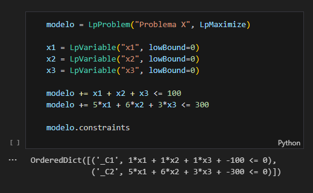

### Como a função objetivo funciona

Quando você insere:
```
problema += 3000 * x1
```

Isso quer dizer que você atribuiu o peso 3000 à variável `x1` e adicionou esse peso ao objetivo do modelo.

Como você não utilizou nenhum operador de comparação nessa linha, o modelo entende que você está adicionando um valor ao objetivo, e não a uma restrição.
Vários valores podem ser adicionados ao mesmo objetivo, e o mesmo vale para as restrições.
Claro que isso quer dizer que o objetivo considerará TODOS os valores que você adicionou a ele, e não apenas o último. Ele os considera todos concatenados por `+`.

Outro ponto importante:

Tenha em mente que ele mudou o `__mul__` e o `__rmul__` (assim como todos os "operator overloadings" do python) do `x1` para `3000 * x1` e `x1 * 3000`, respectivamente.
Isso significa que o modelo não está apenas multiplicando o valor de `x1` por 3000, mas sim que ele está armazenando essa informação para uso posterior.
O mesmo acontece com a soma, subtração e divisão.
Isso acontece pois ele salva um `pulp.LpAffineExpression` nos metadados do modelo, que é uma expressão matemática que representa a operação realizada.
O modelo não está apenas realizando a operação, mas sim armazenando o resultado para uso posterior.

Quando você concatena a mesma operações algumas vezes na mesma variável ela faz o cálculo antes mesmo de executar o modelo, por exemplo:

| Código               | Interpretação do PuLP | Explicação                                                               |
| -------------------- | --------------------- | ------------------------------------------------------------------------ |
| `1.5*x1`             | `'1.5*x1'`            | Exemplo convencional                                                     |
| `1.5*x1 + 1.5`       | `'1.5*x1 + 1.5'`      | Operações diferentes na mesma variável; Nada foi pré-calculado           |
| `1.5*x1 + 1.5*x2`    | `'1.5*x1 + 1.5*x2'`   | Mesma operação em variáveis diferentes; Nada foi pré-calculado           |
| `10*1.5*x1 + 1.5*x2` | `'15.0*x1 + 1.5*x2'`  | Mesma operação de multiplicação na "x1", então o valor foi pré-calculado |
| `1.5*x1*10 + 1.5*x2` | `'15.0*x1 + 1.5*x2'`  | Mesmo concatenando o valor após a variável, o valor foi pré-calculado    |

Caso seja necessário, o PuLP te dá um método de visualização para cada variável da função objetivo:


### Definindo Restrições

Quando uma restrição é aplicada, por exemplo:

```
modelo += 10000*x1 + 5000*x2 + 20000*x3 <= 20000, 'Capital Total Disponível'
```

O modelo identifica que isso é uma constraint quando você adiciona operadores de comparação (como `>=`, `<=`, `==`, etc) .
Essa diferenciação ocorre pois o modelo faz um overload nesses operações (com métodos como `__lt__`, `__le__`, `__eq__`, etc).
Estaremos adicionando a expressão completa ao modelo, e na hora do solve(), o modelo irá calcular a restrição levando em conta o peso especificado de cada variável.

As constraints do modelo podem ser visualizados a qualquer momento com os atributos `modelo.constraints` ou `modelo.coefficients` (coeficientes são os pesos atribuídos à cada variável usada na constraint); Como no exemplo:



| Onde C1 é o primeiro constraint e C2 é o segundo.

// será que também é legal falar do comentário que pode ser adicionado ao final da expressão? modelo += 2.5*x1 + x2 + x3, 'Total de Clientes Atendidos' // eu não sei como isso funciona, então não vou falar sobre

// Parte não revisada

### Múltiplas Restrições

Retornando ao objetivo onde todas as variáveis possuem o mesmo valor, vamos aplicar uma segunda restrição (que pode ser por exemplo, de horas diárias de trabalho):

```
modelo += 3*x1 + 7*x2 + 4*x3 <= 12, 'Total de Clientes Processados'
```

Nesse caso, o modelo percebeu que não é mais possível pegar 2 vezes o x2, já que ele vale 7 num contexto em que o máximo é 12. Agora serão feitos outros cálculos, e as outras variáveis agora podem ter mais valor com base na segunda restrição.

Com as restrições isoladas, podemos concluir que os máximos seriam:

**Rest1 (Capital):**
- x1 = 2
- x2 = 4 (Por isso foi escolhida quando isolada, já que é um modelo de maximização)
- x3 = 1

**Rest2 (Processamento):**
- x1 = 4 (em um caso isolado, essa aqui teria sido a escolhida com 4 usos)
- x2 = 1 (e sobram 5 horas)
- x3 = 3

Considerando ambas as restrições simultaneamente, e já que todas as variáveis têm o mesmo valor na função objetivo, o modelo vai buscar a maior quantidade possível de variáveis. Os valores máximos possíveis são:

```
x1 = 1
x2 = 1
x3 = 0
```

ou

```
x1 = 2
x2 = 0
x3 = 0
```
